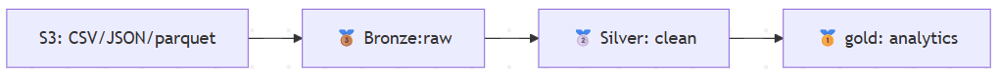

# 👟 KICKZ EMPIRE — ELT Pipeline

ELT (Extract, Load, Transform) pipeline for the **KICKZ EMPIRE** e-commerce website, built as part of the IMT Data Engineering course.

## 📌 1. Context

KICKZ EMPIRE is a fast-growing e-commerce platform specializing in sneakers and streetwear (Nike, Adidas, Jordan, New Balance, Puma…). The store offers a wide range of products including sneakers, hoodies, t-shirts, joggers, and accessories to customers worldwide.

Over the past few weeks, large volumes of data have been collected:

Orders
Product catalog
User registrations
Customer reviews
Clickstream events

These datasets are currently stored as raw files in an AWS S3 data lake in multiple formats (CSV, JSONL, Parquet). However, this raw structure makes it difficult to query and analyze the data efficiently.

As a result, key business questions remain unanswered:

How much revenue is generated daily?
Which products are trending?
Which brands and categories perform best?

👉 The objective of this project is to build a robust ELT pipeline based on the Medallion Architecture (Bronze → Silver → Gold) to make this data actionable.

We also implement best practices such as:

Data testing
Logging
Monitoring

to ensure the pipeline is production-ready.


## 🏗️ 2. Architecture





| Layer | Schema | Description |
|---|---|---|
| **Bronze** | `bronze_group5` | Raw data — faithful copy of CSV files from S3 |
| **Silver** | `silver_group5` | Cleaned data — internal columns removed, PII masked |
| **Gold** | `gold_group5` | Aggregated data — ready for dashboards |


## 🚀 3. Setup instructions

```bash
# 1. Clone the repo
git clone <repo-url>
cd imt-elt-coding

# 2. Configure the  virtual environment
python -m venv venv

source venv/bin/activate

pip install -r requirements.txt
```

```bash
# 3. Test the connection

cp .env.example .env  # Configure with your credentials (DB + AWS)

python -m src.database
```

## ▶️ 4. Run the Pipeline
```bash
#  Extraction step (Bronze)
 python pipeline.py --step extract   # Run extraction only

#Transform step (Silver)
 python pipeline.py --step transform # Run transformation only

# Aggregations steps (Gold)
python pipeline.py --step gold      # Run Gold layer only

# Full Pipeline
python pipeline.py                  # Run the full pipeline
```

## 🧪 5. Testing
```bash
# Run all tests
pytest tests/ -v

# Run with coverage report
pytest tests/ -v --cov=src --cov-report=term-missing
```

## ⚙️ 6. Tech Stack

- **Python 3.10+** : Main language
- **pandas** : Data manipulation
- **boto3** : AWS S3 access
- **SQLAlchemy** : ORM / PostgreSQL connection
- **PostgreSQL** (AWS RDS) : Database
- **pytest** : Testing (TP2)

## 👥 7. Team Members
- **Eva LANSALOT**
- **Kamon SOURABIE**
- **Nada ALEIAN**
